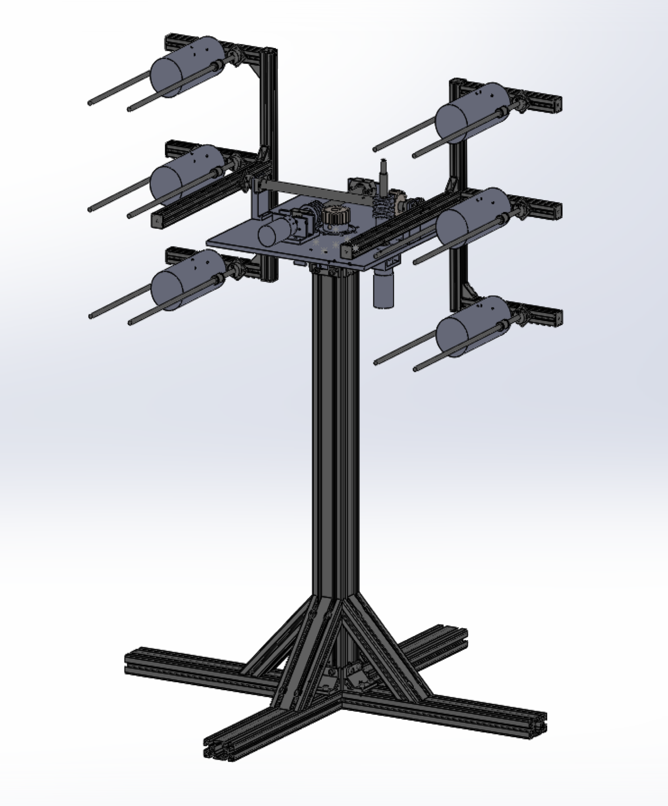
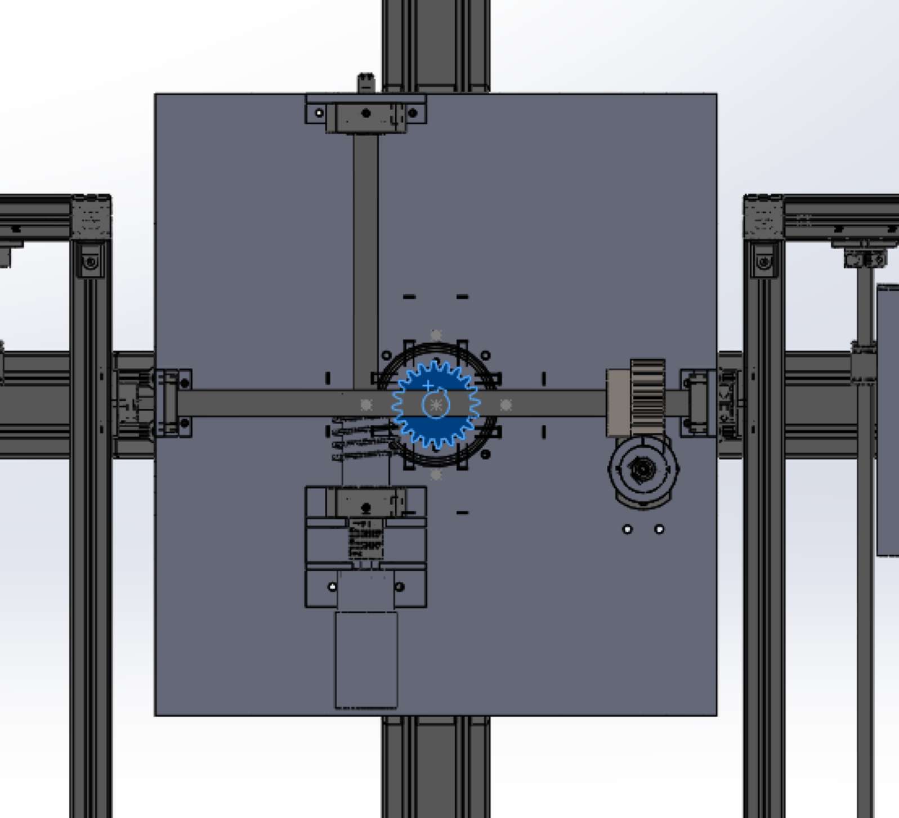
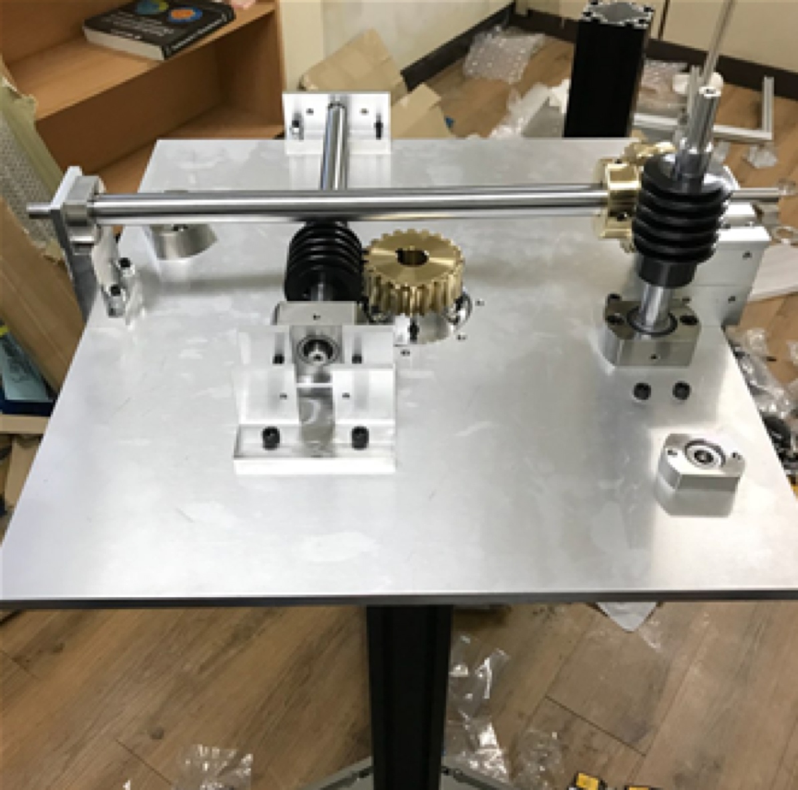

# Sphoenix
Multiple Rocket Launching Robot

## Design
- Body

- Gear-box

- Rocket (engine)

## Specification
- FDM 3D printed solid rocket engine 
- Launch 6 rockets
- Ignite electrically
- P-control algorithm

## Test
- (youtube link)

   

## Related works
- Project: 메이커 창작활동 지원사업 (한국과학창의재단, 2018)
- Patent: Production method of solid projectile (특허등록번호, 10-2181636-0000)

## Contributors
- 이정락 유지호 김지환 이주용 고예송