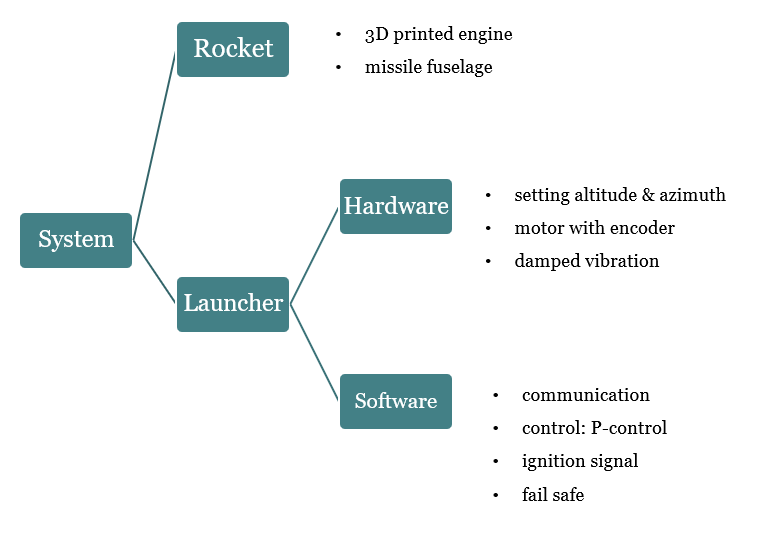
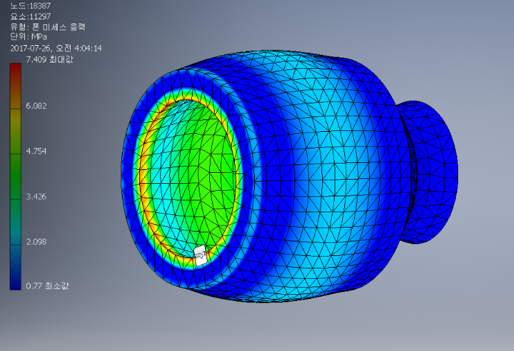
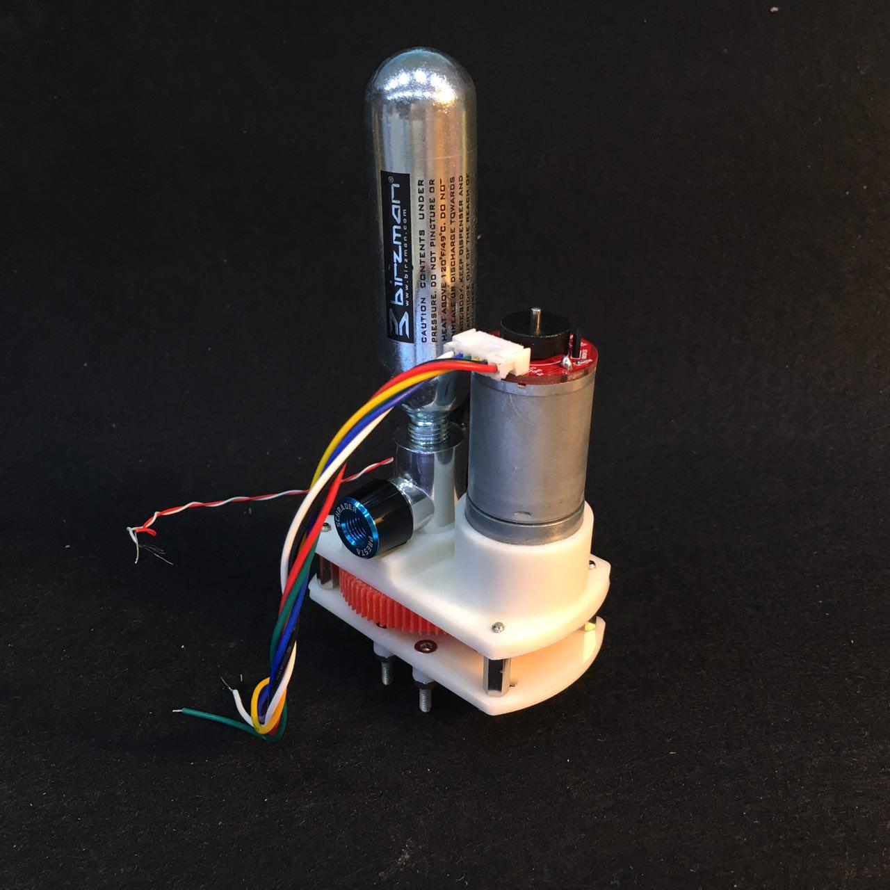
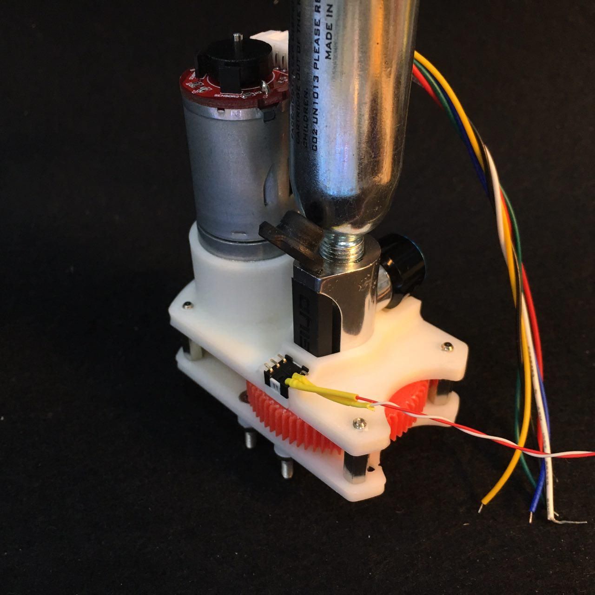
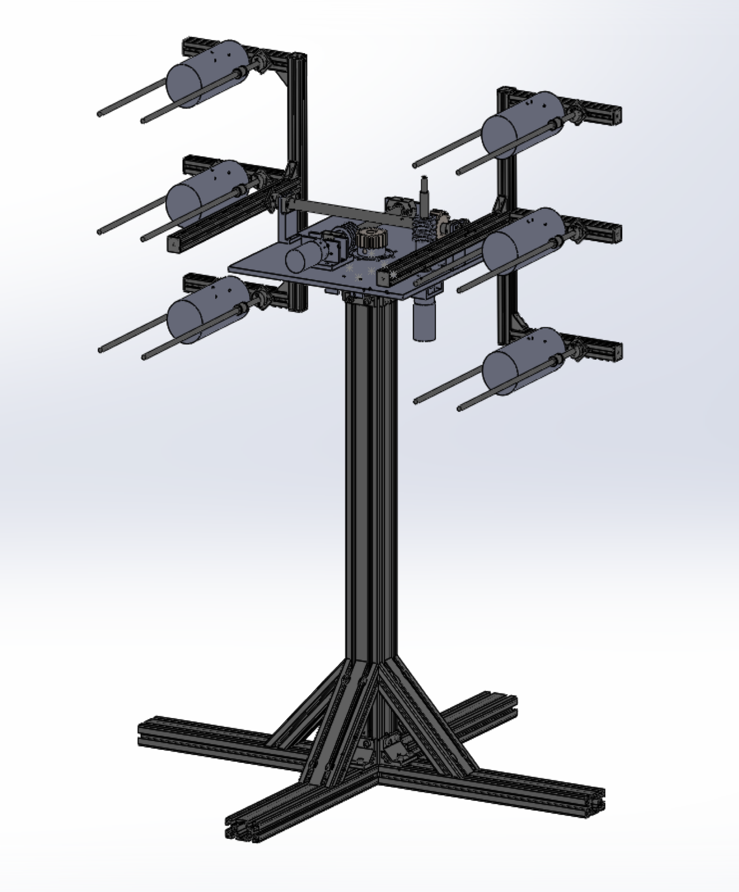
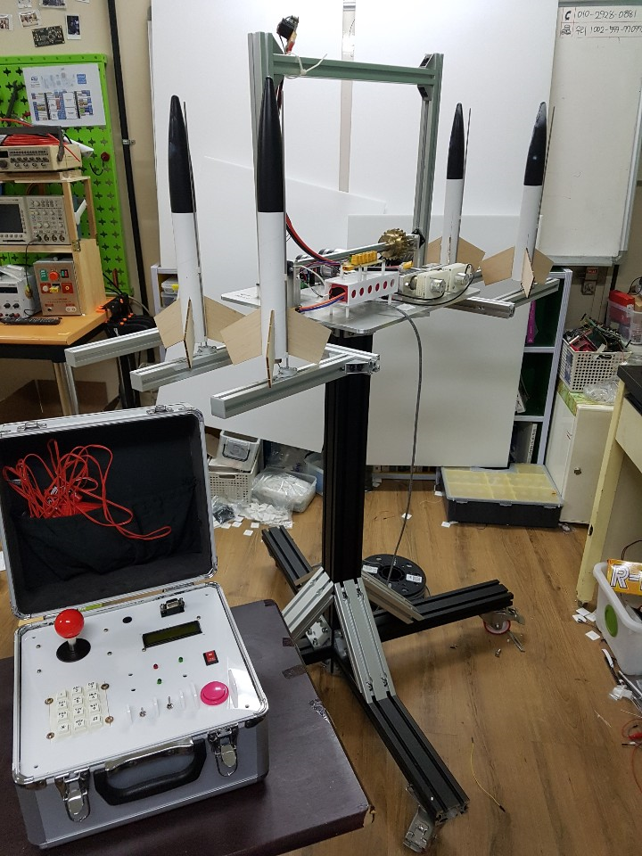
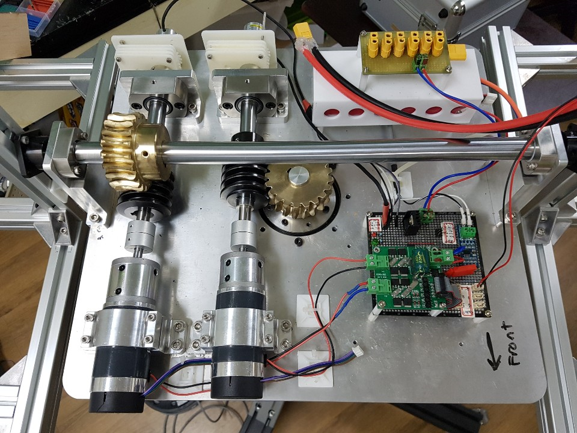
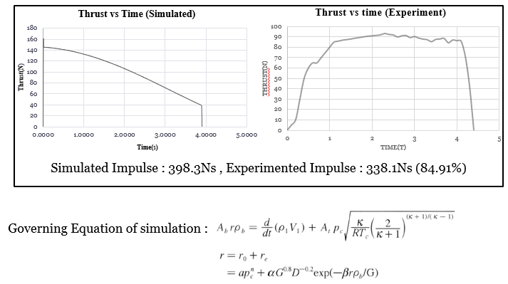
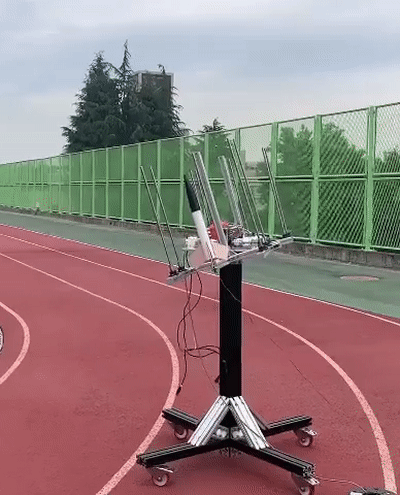

# Sphoenix
Multiple Rocket Launching Robot

## Specification
- FDM 3D printed solid rocket engine 
- Launch 6 rockets
- Motor control: P-control algorithm with absolute-encoder
- Vibration damping with rigid couplings
- Communication: RS485 module
- Ignite electrically

## Design
### System

### Engine
- chamber

- ejection

### Rocket

### Launcher
- model (v1)

- prototype (v2)

## Demo
- control

- thrust

- launch

   

## Related works
- Project: 메이커 창작활동 지원사업 (한국과학창의재단, 2018)
- Patent: Production method of solid projectile (특허등록번호, 10-2181636-0000)

## Contributors
- 이정락 유지호 김지환 이주용 고예송     
- 이정락 김지환 유지호 김래언 이지연 민진식
